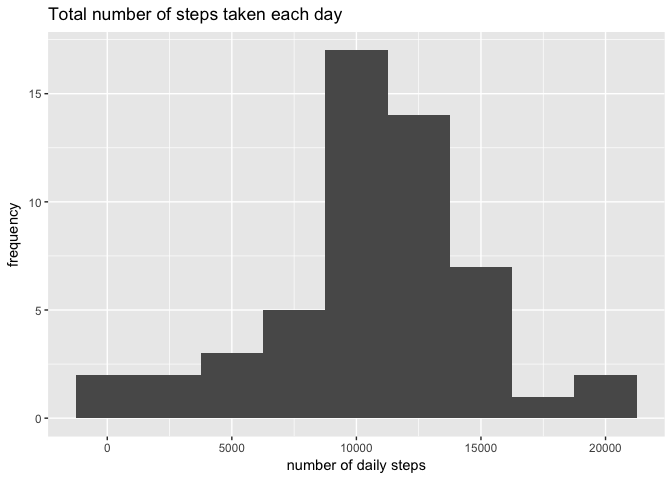
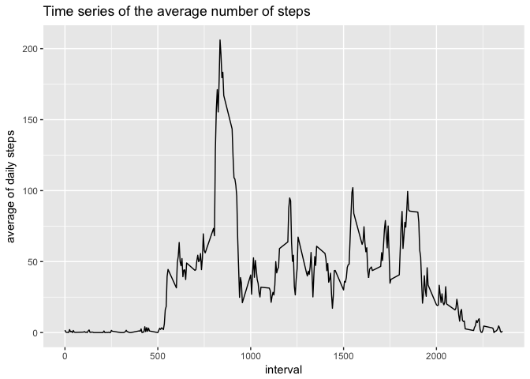
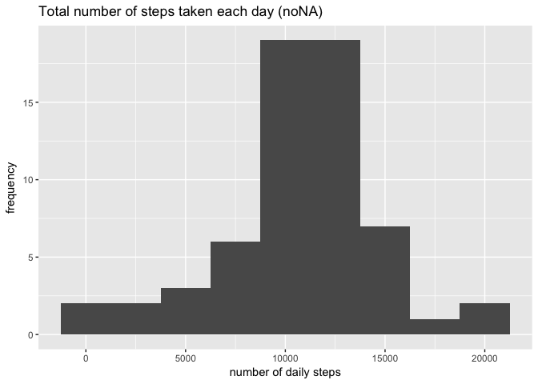
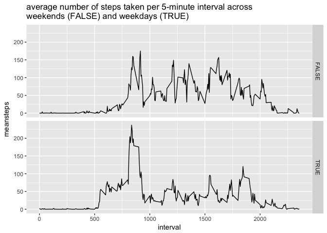

# Reproducible Research: Peer Assessment 1

To run the analysis the working directory has to be set to the files folder and the following packages need to be open:


```r
library(ggplot2)
```

```
## Warning: package 'ggplot2' was built under R version 3.3.2
```

```r
library(plyr)
library(chron)
```

```
## Warning: package 'chron' was built under R version 3.3.2
```


The assignment consists on answering the following items:

1.Code for reading in the dataset and/or processing the data.

The variable date needs to be converted to the conventional date format.
Having the weekday is important in a forward step.


```r
unzip("activity.zip")
activity_file <- read.csv("activity.csv")
activity_file$date <- as.Date(activity_file$date, "%Y-%m-%d")
activity_file$weekday <- weekdays(activity_file$date)
```

2.Histogram of the total number of steps taken each day.

Data having NA was disregarded.
In most days the number of steps taken each day is between 10 and 15 thousand.


```r
sumstepsbyday <- ddply(activity_file, ~date, summarise, sumsteps = sum(steps))
qplot(sumsteps, data = sumstepsbyday, binwidth = 2500,
      main = "Total number of steps taken each day", xlab = "number of daily steps",
      ylab = "frequency")
```

```
## Warning: Removed 8 rows containing non-finite values (stat_bin).
```

<!-- -->

3.Mean and median number of steps taken each day.

Data having NA was disregarded.


```r
dailysteps_mean <- round(mean(sumstepsbyday$sumsteps, na.rm = TRUE))
dailysteps_median <- round(median(sumstepsbyday$sumsteps, na.rm = TRUE))
```

The mean number of steps taken each day is 1.0766\times 10^{4} and the median is 1.0765\times 10^{4}.

4.Time series plot of the average number of steps taken.


```r
meanstepsbyinterval <- ddply(activity_file, ~interval, summarise, meansteps = mean(steps, na.rm = TRUE))
qplot(interval, meansteps, data = meanstepsbyinterval, geom = "line",
      main = "Time series of the average number of steps", 
      xlab = "interval", ylab = "average of daily steps")
```

<!-- -->

According to the graphic, the average number of steps are higher in the morning.

5.The 5-minute interval that, on average, contains the maximum number of steps.


```r
sumstepsbyinterval <- ddply(activity_file, ~interval, summarise, sumsteps = sum(steps, na.rm = TRUE))
maxstepsinterval <- sumstepsbyinterval[sumstepsbyinterval$sumsteps == max(sumstepsbyinterval$sumsteps),1]
```
The maximum number of steps is related to the 835 minute.

6.Code to describe and show a strategy for imputing missing data.

The strategy consists on defining the average number of steps for a particular interval of each weekday (disregarding NA values). The average values are then input in each not available value for the variable "steps".


```r
activity_file_noNA <- activity_file
meansteps <- ddply(activity_file_noNA, .(interval, weekday), summarise, meansteps = mean(steps, na.rm = TRUE))
n <- nrow(activity_file_noNA)
for(i in 1:n){
      if(is.na(activity_file_noNA[i,"steps"])) {
            interval <- activity_file_noNA[i,"interval"]
            weekday <- activity_file_noNA[i, "weekday"]
            activity_file_noNA[i, "steps"] <- meansteps$meansteps[meansteps$interval == interval & meansteps$weekday == weekday]
      }
}
```

7.Histogram of the total number of steps taken each day after missing values are imputed.

The new histogram does not change much regarding the previous one. However, the values are available for other analysis.


```r
sumstepsbyday_noNA <- ddply(activity_file_noNA, ~date, summarise, sumsteps = sum(steps))
qplot(sumsteps, data = sumstepsbyday_noNA, binwidth = 2500,
      main = "Total number of steps taken each day (noNA)", xlab = "number of daily steps",
      ylab = "frequency")
```

<!-- -->


```r
dailysteps_mean_noNA <- round(mean(sumstepsbyday_noNA$sumsteps, na.rm = TRUE))
dailysteps_median_noNA <- round(median(sumstepsbyday_noNA$sumsteps, na.rm = TRUE))
```

The mean number of steps taken each day is 1.0821\times 10^{4} and the median is 1.1015\times 10^{4}.

8.Panel plot comparing the average number of steps taken per 5-minute interval across weekdays and weekends.

In the plot, FALSE represents the Weekends and TRUE the Weekdays.


```r
activity_file_noNA$weekend <- !is.weekend(activity_file_noNA$date)
meanstepsbyinterval_noNA <- ddply(activity_file_noNA, .(interval, weekend), summarise, meansteps = mean(steps))
g <- ggplot(meanstepsbyinterval_noNA, aes(interval, meansteps))
g + geom_line() + facet_grid(weekend~.) + ggtitle("average number of steps taken per 5-minute interval across \nweekends (FALSE) and weekdays (TRUE)")
```

<!-- -->

On weekdays there are two periods where the number of steps are higher, in the morning in particular and in the late afternoon. On weekends the number of steps are consistent all over the daytime.
